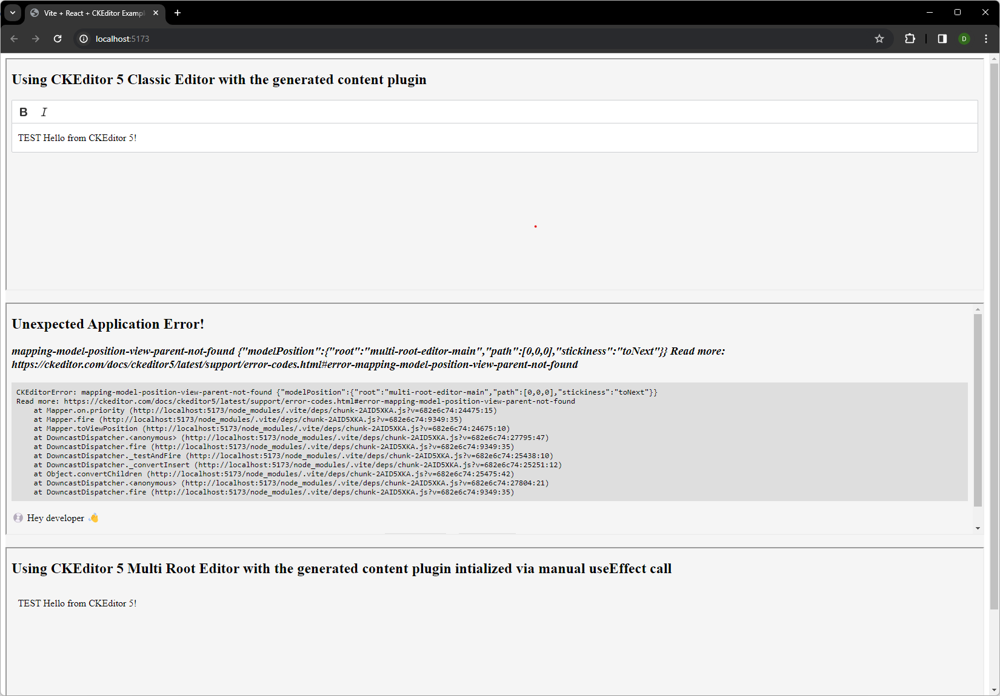

# ckeditor5-react-plugin

This repo contains a repro of an issue with CKEditor5 configuration when using `useMultiRootEditor` and a custom widget.

When using `useMultiRootEditor` and a custom widget, the editor crashes with the following error:

```
mapping-model-position-view-parent-not-found {"modelPosition":{"root":"numbered_prefatory_text_nkqRVYKF-prefatory-text-0","path":[0,0,0],"stickiness":"toNext"}} Read more: https://ckeditor.com/docs/ckeditor5/latest/support/error-codes.html#error-mapping-model-position-view-parent-not-found
```

[Error documentation can be found here](https://ckeditor.com/docs/ckeditor5/latest/support/error-codes.html#error-mapping-model-position-view-parent-not-found)

This error however is not reproducible when using `<CKEditor>` component from the `@ckeditor/ckeditor5-react` package, or when using manual initialization of the editor.

## Additional context

This project was bootstrapped with [Vite](https://vitejs.dev/guide/), using the `react-ts` template.

### CKEditor guides followed

- CKEdtitor integration leverages this guide [Integrating from source using Vite](https://ckeditor.com/docs/ckeditor5/latest/installation/advanced/alternative-setups/integrating-from-source-vite.html)
- The custom widget is a simplified version of the inline widget, referenced here [Implementing an inline widget](https://ckeditor.com/docs/ckeditor5/latest/tutorials/widgets/implementing-an-inline-widget.html#final-solution)
- Examples are following these guides:
  - [Classic Editor example](./src/pages/ClassicEditorExample.tsx) integration is using [React Integration guide](https://ckeditor.com/docs/ckeditor5/latest/installation/integrations/react.html)
  - [MultiRootEditor via hook example](./src/pages/MultiRootEditorViaHookExample.tsx) integration is `useMultiRootEditor` [ckeditor/ckeditor5-react](https://github.com/ckeditor/ckeditor5-react)
  - [MultiRootEditor via manual initialization example](./src/pages/MultiRootEditorViaManualInitializationExample.tsx) integration is using manual initializing that follows [vanilla JS example](https://ckeditor.com/docs/ckeditor5/latest/examples/builds/multi-root-editor.html)

## Running the app locally

### Prerequisites

- [Node.js](https://nodejs.org/en) version 18+. 20+., version requirement is driven by [Vite](https://vitejs.dev/guide/#scaffolding-your-first-vite-project)

### Running the app

Install dependencies:

```bash
yarn
```

Run the application in DEV mode

```bash
yarn dev
```

Assuming default configration & port is available the app will be served at [http://localhost:5173/](http://localhost:5173/)

You should be able to see something like this


